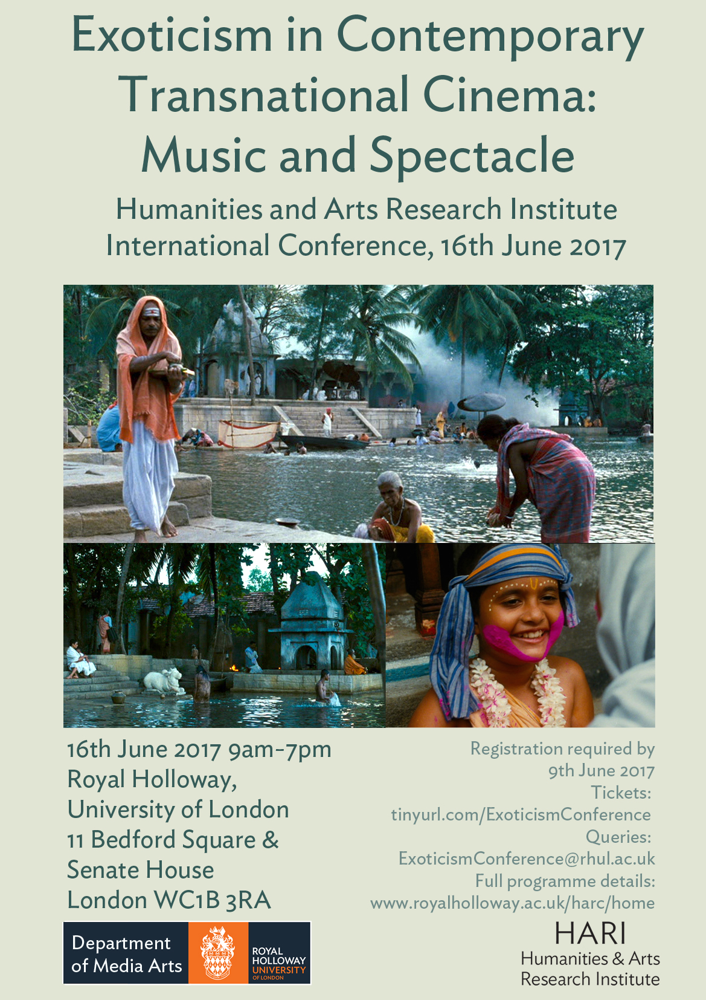

This conference, which is part of Daniela Berghahn (Media Arts) and Anna Morcom’s (Music) joint HARI Research Fellowship, aims to reassess the exotic in contemporary transnational cinema. It asks how the collapsed distances of globalisation and the transnational flows of media and people have affected exoticism, which is no longer exclusively the projection of Orientalist fantasies of the Other from one centre, the West, but which emanates from multiple localities and is multi-directional in perspective. Bollywood’s song and dance sequences, performed against the backdrop of the Swiss Alps and other spectacular foreign settings, the cocktail of exotic locations from around the world that add local colour to James Bond movies and the transnational revival of the Chinese wuxia genre all capitalise on the spectacle of the exotic in a bid for box office success. Music, as a multi-layered semiotic device, has been used abundantly to evoke the Other in background scores as well as in song sequences in musical films. Unfamiliar sounds may also be used for the purposes of aural spectacle, feeding demand for newness in rapidly changing capitalist entertainment industries. In addition, its flexibility allows for Other sounds to be interwoven with familiar idioms.

The international conference is is part of Daniela Berghahn (Media Arts) and Anna Morcom's (Music) joint HARI Research Fellowship and hosted by the Humanities and Arts Research Institute and the Media Arts Department at Royal Holloway. Bringing together researchers with special interest and expertise in contemporary transnational and world cinema, film music and ethnomusicologists, this conferencewill explore how contemporary transnational cinemas imagine the exotic, paying particular attention to the role of sound, music and spectacle.

Keynote Speakers: 

Professor Rachel Dwyer, Professor of Indian Cultures and Cinema, School of Oriental and African Studies, University of London

Professor Song Hwee Lim, Associate Professor and Director of the Centre for Cultural Studies, The Chinese University of Hong Kong

Dr Laudan Nooshin, Reader in Ethnomusicology, City University of London

## Programme

***Panel 1 (9.30-10.50)*** 

**1A: Historical Exoticism/Exoticising History** (Bedford Square Room 101)

Chair: Daniela Berghahn

“The Man or the Mandolin?: Anthony Firingi, Cultural Memory and the Making of a Star”

Priyanka Basu, The British Library, Asian and African Collections

“Silent Travelogues as/and Popular Ethnomusicology? The Musical Mediation of Tibet in London’s Everest Film Performances, 1922-1925”

Julie Brown, Royal Holloway, University of London

“Unnecessary Pasts: Earning the Pleasure in World Heritage Cinema”

Alan O’Leary, University of Leeds

**1B: Exoticism on Screen: Past and Present** (Bedford Square Room 103)

Chair: Mohsen Bipparva 

“Jazz and Opera in Film: Musical Representations of Exotic Utopias and Dystopias in *Cabin in the Sky* (1943) and *Le Rossignol* (2005)”

José Dias and Angela Kang, Manchester Metropolitan University

“Restoring and Digitising the Exotic: Martin Scorsese’s World Cinema Project”

Jean-Baptiste de Vaulx, Royal Holloway, University of London

“Musicking Against the Grain: Tanya Tagaq and *Nanook of the North* (1922)”

Ho Chak Law, University of Michigan, Ann Arbor

***Keynote*  (11-11.50)**               

Senate House Room 261

Chair: Anna Morcom

“My Name is Anthony Gonsalves: Imagining Goa and Goans as Exotic in Hindi Cinema”

Professor Rachel Dwyer, Professor of Indian Cultures and Cinema, School of Oriental and African Studies, University of London

 **12-1: Catered Lunch** (11 Bedford Square)

***Panel 2 (1-2.20)***

**2A: Citizens of the World: Travel, Cosmopolitanism, and Global Exoticism** 

(Bedford Square Room 101)

Chair: Priyanka Basu

“‘YOLO’: The Consumable Exoticism of the Travel Film”

Koel Banerjee, University of Minnesota, Twin Cities

“Persian Calligraphy and Chador: Iranian Contemporary Art and the Undying Self-exoticism”

Mohsen Biparva, Independent Scholar

“Central American Cinema and the Appeal of Global Exoticism”

Luis Fallas, Newcastle University

**2B: Diasporic Filmmaking: Self-Exoticism and Commodifying Difference** 

(Bedford Square Room 103)

Chair: Koel Chatterjee

“Seeing Themselves Through Western Eyes? Diasporic Filmmakers as Purveyors of the Exotic”

Daniela Berghahn, Royal Holloway, University of London

“Exoticism and Representations of Otherness in the Cinema of Fatih Akin”

Sarra Kassem, Independent Scholar

“The Politics of Exotic in Chinese Diasporic Films”

Sarah Fang Tang, University of Nottingham  

***Keynote*  (2.30-3.20)**              

Senate House Room 261

Chair: Daniela Berghahn

“The Exotic in Contemporary Chinese Cinemas”

Professor Song Hwee Lim, Director of the Centre for Cultural Studies 

The Chinese University of Hong Kong 

***3.20-3.40: Coffee Break***   (Senate House Room 261)

***Panel 3 (3.40-5)***

**3A: Music, Sound, and Silence** (Bedford Square Room 101)

Chair: Sara Kassem 

“The Othering of a Musical Gesture in Hollywood and Bollywood: Construction of New Identities Through the♭2”

Sarha Moore, Independent Scholar

 “Music in Films of a State-less Nation: Kurdish Films in Eastern Kurdistan (Iran)”

Mojgan Etemad, Royal Holloway, University of London

 “Margins and Extremes in Contemporary Filipino Cinema: Silence, Ellipses, Chaos and Cacophonies in Lav Diaz’ *Ang Babaeng Humayo* (The Woman Who Left) and Brillante Mendoza’s *Kinatay* (Butchered)”

John-Patrick Ayson, State University of New York, Buffalo

**3B: Appropriation, Adaptation and Exoticism** (Bedford Square Room 103)

Chair: Sarah Wright

“Exoticism and Appropriation: Representing and Assimilating Others and Their Music in Hindi Film Songs”

Anna Morcom, Royal Holloway, University of London

 “Using Exoticism to Make sense of Shakespeare: Examining the Mousetrap Sequence in *Haider”*

Koel Chatterjee, Royal Holloway, University of London

 “Exoticism is in the Listening: Hindi Film Song Reception in Post-Colonial Ghana”

Katie Young, Royal Holloway, University of London

**\*Keynote (5.10-6**)*        

Senate House Room 261

Chair: Anna Morcom

"Windows onto other Worlds. Musical Exoticism in Iranian Cinema: Between National Imaginary and Global Circulation”

 Dr Laudan Nooshin, Reader in Ethnomusicology, City, University of London

**Wine Reception (6-7)**    11 Bedford Square Garden

## **Abstracts**

 **Ayson, John-Patrick, State University of New York, Buffalo , “Margins and Extremes in Contemporary Filipino Cinema: Silence, Ellipses, Chaos and Cacophonies in Lav Diaz’ *Ang Babaeng Humayo* (*The Woman Who Left*) and Brillante Mendoza’s *Kinatay* (*Butchered*)”** 

This presentation will delve into the silences, ellipses, chaos and cacophonies in contemporary Filipino cinema — within the context of fringe, marginal figures, extreme criminal practices and the infamous Manila traffic — particularly *in Ang Babaeng Humayo* (*The Woman Who Left*, 2016) by Lav Diaz and *Kinatay* (*Butchered*, 2009) by Brillante Mendoza. In Lav Diaz’s *Ang Babaeng Humayo* (winner of the Golden Lion Award at the 2016 Venice Film Festival ) protagonist Horacia’s relationships with the transexual sex worker Hollanda and the unnamed peddler of balut, the common Filipino street food, are both illustrative portraitures of exotic, marginal figures in present day Filipino culture and evocative displays of Diaz’ trademark use of long takes, silences and ellipses, particularly in their long, seemingly uninterrupted, nighttime walks on the streets of Manila.

As a direct contrast, the second, concluding half of this talk will then shift its focus onto *Kinatay* (whose director, Brillante Mendoza, took home the 2009 Prix la mise en scene/ Best Director award in Cannes) particularly on the film’s odd-angled, jump cut visuals and cacophonous, chaotic soundscapes of the infamous Manila traffic — and the brutal rape, torture and slaughter scene of Madonna, the Filipina prostitute — which parallels the unhinged, cruel nature of snuff films.

**John-Patrick Ayson** is an artist, writer and PhD candidate in the Department of Media Study at the State University of New York in Buffalo. Among a number of projects, he is currently working on *(all-you-can-eat) Ice Cream, Jello and Yogurt* an art installation on local/global food economies, climate change and the Anthropocene for the Fall of 2017.

**Banerjee, Koel; University of Minnesota, Twin Cities, “‘YOLO’: The Consumable Exoticism of the Travel Film”** 

This paper explores how travel films enact the contradiction inherent in the processes of globalization which, as Fredric Jameson argues, creates the illusion of difference while producing sameness. I argue that the dialectics between the fear of homogenization and the desire for “a new exotic” that is also simultaneously standardized animates contemporary travel films, including those from the periphery of the world-system. Travel films, in the age of globalization, mediate the desire for the exotic through the traveling subject’s consumption of cultural difference. They offer a celebratory vision of globalization, one that conceals the logic of capitalism under the larger idea of global unity. The protagonists of such cinematic accounts are often presented as cosmopolitans who, in their exploration of other cultures, display an ethic of congeniality which, however tenuously, bypasses the unequal center-periphery dynamic of the world-system. This paper focuses on the Bollywood film *Zindegi Na Milegi Dobara* (*You Won't Get This Life Again,* Zoya Akhtar, 2011), a coming of age film about three affluent young men who embark on a road trip across Spain. *Zindegi Na Milegi Dobara* proudly presents the cosmopolitan Indians who, by virtue of their privileged social position, are unencumbered by the Indian stereotypes found in popular cultural representations. The protagonists take part in exotic adventures including the Bull Run in Pamplona and the Tomatina Festival in Buñol. Even as it presents the exotic as a consumable cinematic spectacle, the film depicts the protagonists as being at home in the world. I query the effect that such visual excess has on the local spectator. The travel-brochure quality of the film’s cinematography fuels the cosmopolitan desires of the aspiring locals who then seek to import the exotic Tomatina Festival to the streets of Mumbai. I argue that invitation to cinema is an invitation to consume the new exotic -- directly and conspicuously if one is able to afford such luxuries, or vicariously, i.e. by importing exotic festivals from abroad to our own streets. I argue that the exotic as a cinematic spectacle is more than visual excess; rather, it is the *weltanschauung* of a consumptive cosmopolitanism. 

**Koel Banerjee** is a PhD Candidate in the Department of Cultural Studies and Comparative Literature at the University of Minnesota, Twin Cities. Her doctoral dissertation explores how an ethic of consumption underwrites the discourse on Bollywood cinema. She focuses on commodity aesthetics to trace the transformations that Hindi Cinema underwent from the mid- 1990s to the present. Her research interests include Indian Cinema, cinematic and literary melodramas, and Cultural and Critical Theory, especially the Frankfurt School.

**Basu, Priyanka; The British Library, Asian and African Collections, “The Man or the Mandolin?: Anthony Firingi, Cultural Memory and the Making of a Star”**

The mythic-historical figure of Anthony Firingi (1786-1836) has remained a fascination for the urban middle-class Bengali imagination, largely fuelled by the cult status of a bio-pic (*Anthony Firingi*, 1962) on the nineteenth century performer. Anthony Firingi (originally, Hensman Anthony) came from a family of Portuguese salt-traders in the French colony of Chandannagar outside the city of Calcutta. Bengali literary histories document Anthony as a kobiwallah (a performer of Kobigaan which is a song-contest tradition prevalent in Bengal) who was drawn towards the virtuosity in Kobigaan, and thus learnt and ‘became’ Bengali in order to be accepted into the contemporary performing community. The appeal of the ‘Bengalised Englishman’ who ‘was not a low graded Kobiwala as others were’ (Gopinath Sen, 1962) however, has not translated into much research on Anthony as an enigmatic persona and a product of the European-Bengali cultural syncretism; except for a full-length novel (*Madan Bandopadhyay*, 1962), a play (*Umanath Bhattacharya*, 1963), and two Bengali mainstream films (1962, 2014). Of these visual and written texts, the 1962 bio-pic remains ingrained and fresh in Bengali cultural memory, owing to its ground-breaking ‘modern’ musical score and the iconic portrayal of Anthony by Uttam Kumar, the Bengali star-actor. This paper takes into account the dearth of available resources on Anthony and relies on the handful of written-visual archive in order to understand (i) why Anthony remains embedded in the Bengali cultural memory so much so that a second bio-pic on him, 52 years later in 2014 earned equal interest; (ii) how the imaginary of a mythic-historical ‘white colonizer’ appropriated into the world of the Bengali ‘Other’ was possibly personified and immortalized by Uttam Kumar’s stardom (he went on to win the National Award for it in 1968); (iii) how the innovations in musical score coupled with stardom allowed the film to become a metonymy for Bengali cinematic traditions on folk genres. Public memory involves dual processes of establishing remembrances and maintaining them for the public. (Kendall R. Philips, 2004) This paper focusses on the cinematic gaze from the perspective of the ‘Other’ as Anthony still stands representative of the ‘awe-inspiring’ colonizer.

**Dr Priyanka Basu** has completed her PhD from the Department of South Asia in SOAS on a Felix Scholarship and currently works at the Asian and African Collection at the British Library on the AHRC-funded digitization project, “Two Centuries of Indian Print”. Her research looks at the cultural politics of contemporary Bengali Kobigaan in West Bengal and Bangladesh, and her further research interests include performance and film histories, gender, and Dance Studies.

**Berghahn, Daniela; Royal Holloway, University of London,  “Seeing Themselves Through Western Eyes? Diasporic Filmmakers as Purveyors of the Exotic”**

The films of diasporic filmmakers living and working in the West occupy a uniquely interstitial position. (Co-)produced with European or U.S. funding, they, nevertheless, reflect the vantage point and aesthetic sensibilities of Europe’s Others. Operating in a global market where culturally Othered goods are a prized commodity, diasporic filmmakers assume a pivotal role as brokers of alterity. On the global film festival circuit, they win critical acclaim and prized; yet at the same time they are often regarded with suspicion for ‘promoting a sort of self-exoticisation, in which the ethnic, the local or the regional expose themselves, under the guise of self-expression, to the gaze of the benevolent other’ (Elsaesser 2005: 510). 

The critical and commercial success of films like Mira Nair’s *Salaam Bombay* (1988) and Deepa Mehta’s film *Water*(2005) signals the growing recognition ethnic minority filmmakers are enjoying, nevertheless, Mehta and Nair have been blamed for seeing themselves through western eyes, for colluding in strategies of ‘auto-ethnography’ (Pratt 1992), ‘re-Orientalism’ (Lau and Mendes 2011) and self-exoticism in a bid for mainstream western audiences, often at the price of alienating domestic audiences in their real or putative ‘homelands’. 

This paper seeks to examine the films’ exoticist aesthetics and cosmopolitan sensibilities. Attending to the critical reception that has surrounded *Water* and *Salaam Bombay*, it will explore why diasporic filmmakers are expected to make culturally authentic films, whereas majority culture filmmakers like Danny Boyle (*Slumdog Millionnaire*), Michael Winterbottom (*Trishna*), John Madden (*The Best Exotic Marigold Hotel*) and Lasse Halström (*The Hundred Foot Journey*) are given licence to create exotic fantasies.  

**Daniela Berghahn** is Professor of Film Studies in the Media Arts Department and Director of the Humanities and Arts Research Institute at Royal Holloway, University of London. She has widely published on post-war German cinema, the relationship between film, history and cultural memory and transnational cinema. Her extensive work on migrant and diasporic cinema in Europe has been supported by the Arts and Humanities Research Council and is documented on the websites [www.farflungfamilies.net](http://www.farflungfamilies.net/) and [www.migrantcinema.net](http://www.migrantcinema.net/). Her publications include *[Head-On](http://shop.bfi.org.uk/new-releases/head-on-gegen-die-wand.html#.VaPOlet-ouI)* (BFI, 2015), *[Far-flung Families in Film: The Diasporic Family in Contemporary European Cinema](http://www.amazon.co.uk/Far-Flung-Families-Film-Diasporic-Contemporary/dp/0748642900/ref=sr_1_1?s=books&ie=UTF8&qid=1368539377&sr=1-1&keywords=far-flung+families+in+film)* (Edinburgh UP, 2013), *[European Cinema in Motion: Migrant and Diasporic Film in Contemporary Europe](http://www.amazon.co.uk/European-Cinema-Motion-Diasporic-Contemporary/dp/0230278981/ref=sr_1_1?s=books&ie=UTF8&qid=1368539604&sr=1-1&keywords=european+cinema+in+motion)* (co-edited with Claudia Sternberg, Palgrave Macmillan, 2010) and [*Hollywood Behind the Wall: The Cinema of* *East Germany*](http://www.amazon.co.uk/Hollywood-Behind-Wall-Cinema-Germany/dp/0719061717)(Manchester UP, 2005).  Building on her work on diasporic and transnational European cinema, Daniela is working on a new project that explores exoticism in contemporary transnational cinema.   

**Biparva, Mohsen; Independent Scholar, “Persian Calligraphy and Chador: Iranian Contemporary Art and the Undying Self-exoticism”**

This paper will focus on self-exoticism concerning the Iranian Contemporary (visual) Arts, mainly photography and photo-collage. It will also briefly discuss the mutual influence between the Iranian cinema and Iranian visual arts. The Iranian Contemporary Art as presented to the Western world by a number of influential curators during past fifteen to twenty years can be defined by certain characteristics, amongst them self-exoticism. The exotic qualities of these works are mainly empowered by the market demand and the politics of international exhibition industry and galleries of New York, London, LA and Paris. It usually entails reviving and reproducing Orientalistic stereotypes from the mainstream media. 

Meanwhile, self-stereotyping and self-exoticism within the globalised market enables those artists to redefine themselves as ‘citizens of the world’. This is what we can describe as ‘banal globalism’ according to Szerszynsky and Urry (Szerszynski, B. and Urry, J., 2006).

I will look particularly on two main factors of self-exoticism in contemporary Iranian art, *chador* (the Iranian hijab) and the Persian script. I will study works by Shirin Neshat and Shadi Ghadirian as two main examples as well as some other more recent artist. 

In terms of theory, the paper will be informed by works of Homi K. Bhabha and  Edward Said. It will also incorporate ideas such as Gerardo Mosquera’s ‘Marco Polo Syndrome’, Fredric Jameson, Terry Eagleton and David Harvey’s notion of postmodernism. I will argue following Fredric Jameson that the Iranian visual arts as presented to the Western audience, similar to what he calls the ‘third-world texts’ are expected to be ‘national allegories’. This is where the Iranian artists, instead of self-expression find themselves in the realm of self-exoticism. The political narrative of Iran being a pariah state, its Islamic intolerance and so on amplifies this tendency. 

In conclusion, I will argue that despite several recent ‘curated’ exhibitions in London and elsewhere with the aim of demonstrating a ‘new’ trend in the Iranian contemporary art; nothing has significantly changed in terms of their approaches to exoticism since late 1990s. 

**Mohsen Biparva** is an independent scholar, researcher, writer and art critic. He writes on contemporary art, cinema, media and culture. He has a PhD in Media Arts from the University of London

**Brown, Julie; Royal Holloway, University of London, “‘Silent’ Travelogues as/and Popular Ethnomusicology? The Musical Mediation of Tibet in London’s Everest Film Performances, 1922-25”**

Despite ethnomusicology’s heightened interest in film in recent years, the musical dimension of ‘silent’ travelogue shows have received little detailed attention. Indeed, such moving picture shows are far from obvious places to explore early forms of ethnomusicological cultural texts. It is not just that industrially-produced mood music for accompanying ‘silent’ film entrenched the reproduction of orientalist musical clichés; most early nonfiction moving pictures featuring native peoples were commercially, rather than scientifically, conceived and produced; they were intended for popular rather than specialist audiences. Yet the musical dimension of some popular screen shows combined a certain scientific aspiration with commercial endeavor, creating some curious representational clashes as a result. In this paper I will consider two travelogue moving picture events held in London in the early 1920s which presented different expeditions to Mt Everest undertaken by the Royal Geographical Society. Treated very differently in musical terms, these events nevertheless aimed to disseminate a certain scientific knowledge of Tibetan music, further details of which were even published in a parallel journal article. The second film run involved the use on a West End stage of real Tibetan monks performing indigenous music as part of a live stage prologue. Contemporary reception of the musical dimension of these events reveal much about the janus-faced nature of such crosses between world fair ‘living exhibits’ and scientific presentation.

**Julie Brown** is Professor of Music at Royal Holloway, University of London. She is contributing editor with Annette Davison of *The Sounds of the Silents in Britain* (Oxford University Press, 2013), and has also published on a range of other screen music topics. Her recreation of the part-compiled contemporaneous orchestral score and associated musical ephemera of *The Epic of Everest* (J.B. Noel, 1924) appear on the BFI’s DVD release of that film, and her recreation of Frederick Laurence’s fully original 1925 score for *Morozko* (Yuri Zhelyabuzhsky, 1924) has been performed at the Barbican Cinema. Other books include *Schoenberg and Redemption* (Cambridge University Press, 2014), *Bartók and the Grotesque* (Ashgate, 2007), and the edited collection *Western Music and Race* (Cambridge, 2007), which was awarded the American Musicological Society’s Ruth A. Solie Award. *Defining the Discographic Self: Desert Island Discs in Context*, of which she is contributing editor (with Nicholas Cook and Stephen Cottrell), will be published by OUP in September 2017.

**Chatterjee, Koel; Royal Holloway University of London, “Using Exoticism to Make Sense of Shakespeare: Examining the Mousetrap Sequence in *Haider”***

The Mousetrap scene in *Hamlet* is one of the dramatic highlights of the play and Vishal Bhardwaj uses this scene in a spectacular manner within *Haider* (2014)*,* an adaptation of *Hamlet* set within the geographical and political context of Kashmir where Hamlet is both an individual as well as the Kashmiri people. In this paper, I will examine the uses of exoticism in making sense of Shakespeare by analysing this sequence in terms of Bollywood convention and traditional Shakespeare criticism and by comparing Shakespeare’s use of the play-within-the-play against Bhardwaj’s use of the *Bismil* sequence. The Mousetrap device is a popular one in Bollywood; however, the sequence in *Haider* uses song and dance in a manner that is theatrical even by Bollywood standards, thereby exoticising Shakespeare for Indian audiences, even while making Shakespeare spectacular for non-Indian audiences. Yet the sequence is rooted in artistic interpretations of *Hamlet* found in works such as Daniel Maclise’s *The Play Scene in ‘Hamlet’* and Keeley Halswelle’s *The Play Scene in Hamlet* as well as literary criticism such as the Freudian interpretation of the mother-son relationship. In analysing this sequence, I will further seek to explore the reasons behind the popularity of Bollywoodised Shakespeare productions in London in recent years as seen for instance in Iqbal Khan’s RSC *Much Ado About Nothing* in 2012 and Emma Rice’s Globe production of *Midsummer Night’s Dream* in 2016. India is not the only Asian country to have innovatively and spectacularly adapted Shakespeare for a commercial audience, neither is Bollywood the only Indian film industry to have experimented with Shakespeare. Yet the growing Bollywoodisation of Shakespeare productions in London in recent years suggests that Bollywood Shakespeares has led to a new critical engagement with Shakespeare as well as a global afterlife that is making Shakespeare relevant to the multicultural audiences in London in new ways. A study of the uses of exoticism in disseminating Shakespeare to these audiences and scholars is key to our understanding of producing and teaching Shakespeare in coming years. 

**Koel Chatterjee** is writing up her PhD in Shakespeare and Bollywood at Royal Holloway, University of London. Her research focus is the adaptation of Shakespeare in the Hindi film industry after Indian independence. She is also mapping connections between Bengali adaptations of Shakespeare and Bollywood remediations of his plays. She has spoken on Bollywood and Bengali Shakespeares at several conferences and public facing events and has published articles in academic and non-academic journals. She has co-organised two International Indian Shakespeare on film conferences in 2014 and 2016 respectively as well as a film Festival at the British Film Institute, Southbank in 2016. She is currently working on co-editing a collection of articles on the subject as well as an exhibition on Indian Shakespeares in London in 2018.

**Dias, José and Angela Kang; Manchester Metropolitan University, “Jazz and Opera in Film: Musical Representations of Exotic Utopias and Dystopias in *Cabin in the Sky* (1943) and *Le Rossignol* (2005)”**

A comparative approach to how musical exoticism features in a 1940s jazz-comedy and contemporary opera-film can provide a rich platform to consider how strategies/techniques used to mediate visions of cultural Otherness in film can transcend genre, era, and style. One of the only six all-black cast films Hollywood has produced from 1927 to 1954, Vincent Minelli’s 1943 *Cabin in the Sky* loosely reinterprets the Faust legend with a comical, vaudevillesque approach. Music plays a crucial role in sonically shaping the visual representations of Heaven and Hell, by opposing classically orchestrated and choral religious pieces against performances by popular jazz musicians, such as Louis Armstrong and Duke Ellington, respectively. Ironically, although the film was part of an MGM campaign to improve depictions of African Americans in the media, jazz is here portrayed as popular black music and largely associated with evil and sin.

Christian Chaudet’s 2005 film adaptation of Stravinsky’s *Le Rossignol* is abundant with computer generated images of a mythical and alluring Chinese landscape. This ambitious film intertwines live action, animation and a spectacle of special effects including an elaborate display of interactive Chinese porcelain vases, mobile phones, and 21st century technology which are closely juxtaposed with a utopian and archaic Chinese landscape. This film demonstrates how the collapsed distances of globalisation and the transnational flows of media and people have affected musical exoticism in contemporary opera-film. By confronting such seemingly disparate examples, we aim to demonstrate to what extent both opera and jazz have decisively informed the representation in film of the close Other (African Americans) and the far-away Other (China). Furthermore, we aim to reveal how exotic utopias and dystopias are utilised to reveal deeper meanings about cultural identity.

**José Dias** is Senior Lecturer in Music at Manchester Metropolitan University. He has developed research on European jazz networks, exploring the relationships between jazz practices, cultural identity and cultural policies. From his research experience, Dias has been appointed delegate for several jazz festivals across Europe. He has authored and co-authored several articles and book chapters on European jazz peripheralities, jazz networking, jazz in film, and music education. José Dias is also a composer and guitarist, who has worked with such well-known musicians as David Murray. In 2013 he released two albums: *360* and *Magenta* (Sintoma Records); in 2015 he recorded his third album *What Could Have Been: The Seven Deadly Sins* (Sintoma Records, 2016).

**Angela Kang** is Lecturer in Music at Manchester Metropolitan University. She has a wide range of experience working in higher education and in the music industry, including at Rose Bruford College of Theatre and Performance, the University of Nottingham, the University of Hong Kong, and at the Naxos Classical Record Label. In the past few years, she has found great satisfaction in publishing educational resources on exoticism in opera and theatre, designing and delivering a number of music and healthcare projects, and in communicating and developing research findings in national and international conferences, as well as local media. As a flautist, pianist and accordionist trained in the classical music tradition, she maintains a strong interest in how music can improve physical health and well-being.

**Dwyer, Rachel; Professor of Indian Cultures and Cinema at SOAS, University of London, “My Name is Anthony Gonsalves: Imagining Goa and Goans as Exotic in Hindi Cinema”**

Hindi cinema, now known as Bollywood, invariably depicts Goan culture as exotic.  Goa, which became part of the Republic of India in 1961, fourteen years after the British left, is situated 600km south of Bombay/Mumbai. It is seen as a holiday destination, with beautiful beaches, Portuguese architecture, and a different culture manifested in its language, religion, dress and cuisine, where European influence is different from the wider impact of the British.  Goans are also features of Bombay’s cosmopolitan culture, which is not surprising given that many film industry personnel live or are educated in Bandra, Bombay’s centre of Goan culture, marked by Mount Mary Church and now a centre of hipster culture.  \
In my paper, I look at films which show Goa as an exotic but Indian paradise and films which feature Bombay Goans. These include *Bobby*, dir. Raj Kapoor, 1973; and *Amar, Akbar, Anthony*, dir. Manmohan Desai 1977.  I examine the concept of the exotic and its use for understanding this depiction of a religious and regional minority in Hindi cinema which is often considered national as well as transnational and global. 

**Rachel Dwyer** is Professor of Indian Cultures and Cinema at SOAS, University of London. Her main research interest is in Hindi cinema where she has researched and published on film magazines and popular fiction; consumerism and the new middle classes; love and eroticism; visual culture; religion; emotions; stars and star families; Gandhi and the biopic; Hindi cinema in East Africa and in the UK.  [Racheldwyer.com](http://racheldwyer.com/)

**Etemad, Mojgan; Royal Holloway, University of London, “Music in Films of a State-less Nation: Kurdish Films in Eastern Kurdistan (Iran)”**

Historically music had played an important role in the social and cultural life of the Kurds- split across four major states- as a means of orally transmitting historical memory. Although the concept of Kurdish cinema is contested, often seen only to operate at the level of transnational, a common element appears to be the use of music by Kurdish filmmakers as a marker of their cultural identity. This may be traced back to Yilmaz Guney’s *Yol* (1982) which, although in Turkish, used Kurdish music to identify Kurdish concerns.

This paper aims to examine the use of music in the films of Kurdish filmmakers Bahman Ghobadi- particularly *Marooned in Iraq* (2002) and *Half- Moon* (2006) and Jamil Rostami- especially *The Eye* (2012). In Ghobadi’s films, music at times seems to dominate the narrative and act as responses to the marginalization of the Kurdish pupulation. As such it has been argued that Gilles Deleuze’s concept of ‘minor cinema’ may be applied to Ghobadi’s films in their way of telling stories of ‘people yet to come (Santos Aquino, 2016). In Rostami’s more commercial film, which is entirely in Persian, the use of folklore Kurdish songs and the ‘silent’ pictures of their singers on the wall adds a dramatic and nostalgic element to the film.

My aim is to demonstrate that despite the tendency for films such as these to be perceived internationally as ‘picturesque’, and even exotic, the use of folk music and traditional costumes in these films may be seen to address the complexities of Kurdish identity in a way that is often overlooked by non- Kurdish audiences.

**Mojgan Etemad** is a PhD candidate, researching Kurdish Cinema in the Islamic Republic of Iran, in the Media Arts department at Royal Holloway, University of London, under the supervision of John Hill. Her previous degrees include: Politics (BA) from the University of South Bank, International Relations (MA) from the University of Nottingham, and International Law of Human Rights (LLM), from University of Nottingham.

**Fallas, Luis; Newcastle University** , **“Central American Cinema and the Appeal of Global Exoticism”**

Central American Cinema (CAC) is a film category based upon regional belonging, featuring intimate representations of local subjects and spaces. Recent CAC films have spectacularised intimate and sensitive representations of subjects and spaces through an appeal to global exoticism. Implementing an Actor­Network Theory approach to a sample of regional films, I track the enunciation of CAC and also their filmmakers and funders beyond a delimited geographical reference. Through three examples, *A mi lado* (Delaloye, 2012), *Por las Plumas* (Villalobos 2013), and *Nicté* (Dardón, 2012), I expose how the isthmus is presented as extreme, absurd and fantastic. Such cinematic depictions reflect residual colonial discourses of the region as ‘the doubtful strait.’ *A mi lado* (Delaloye, 2012), *Por las Plumas* (Villalobos 2013), and *Nicté* (Dardón, 2012) additionally expose the commercial viability of CAC films in a burgeoning international market: as outside grants and funding ultimately influence producers’ aims and conditions of production, filmmakers increasingly produce exotic representations of CAC in their films, focussing on notions of exceptionalism, precariousness and spectacle.

I turn to Bourdieu to portray how these films reproduce hierarchical relations to the point that extractionism becomes a major concern. First, filmmakers lack mobility, and this alters their access to material goods, directors and subjects necessary for filmmaking. Second, filmmakers are unable to tap into large-scale distribution networks. As such, their films are entangled in a process of production, reproduction, and consecration dynamics related to filmmaking and distribution/consumption processes that Beller (2012) describes as expressions of capitalist extractivist relations. As a film category, CAC films profit from a consumable exoticism that resonates with international markets.

**Luis Fallas** is a documentary filmmaker from Costa Rica doing a theoretical PhD in Film Studies at Newcastle University. He graduated as Licentiate in Mass Communications Sciences with an emphasis on Audiovisual Production from Universidad de Costa Rica. From there on, he has dealt with identity, social conditions and history in his films. He completed an M.A. at University of Applied Sciences Ostwestfalen-Lippe and experimented with animation to produce an animadoc, Banana-Express, about the regional implications of Costa Rica’s first railroad system in the nineteenth century. He is currently a second year PhD student, researching the representations of political economy relations in Central American Cinema, with focus on the twenty-four films prized as best of the region between 2009 and 2014 by the Ícaro Film Festival. He is interested in how the category is being performed or neglected by each film, given that they are its consecrated representatives. 

**Fang Tang, Sarah; University of Nottingham** , **" The Politics of Exotic in Chinese Diasporic Films"** 

In this paper I shall explore the politics of exoticism in Chinese diasporic films by focusing on the film *The Joy Luck Club*(Wayne Wang, 1993). This film is based on the eponymous novel by Chinese-American author Amy Tan, revealing the hidden histories of the elder generation and the conflicts between the traditional Chinese mothers and their America-born daughters. The mothers’ stories reconstruct their past experiences in China. For their daughters, who have grown up in the USA, these Chinese narratives become imaginary fantasies that have emerged in an ‘other’ cultural context and which are informed by complex processes of cultural translation and translocation. By examining how the mothers convey their ‘Chinese stories’ and how their daughters perceive, reconstruct or even resist them, I will examine how these multiply mediated Chinese stories provide a revisionist account of official Chinese history. At the same time, I aim to investigate how *The Joy Luck Club* responds to the West’s perennial fascination with the Orient and whether or not Chinese-American director Wayne Wang employs strategies of self-exoticisation. 

**Sarah Fang Tang** is a PhD candidate at the School of Cultures, Languages, and Areas Studies, University of Nottingham  

**Kassem, Sarra; Independent Scholar, “Exoticism and Representations of Otherness in the Cinema of Fatih Akin”** 

In recent years representations of cultural Otherness have not only become more mainstream in their appeal but also fashionable, attracting wider audiences in comparison to the past and critical acclaim too. A number of films, commonly grouped together under the umbrella term transnational cinema, tell the stories of migrant and diasporic communities living in the West. Although these films are very different in terms of style and thematic preoccupations, what they share in common is an aesthetics of hybridity, which is reflected in the use of multiple languages, ethnic soundtracks, images of non-Western cultural practices and traditions and exotic locations, whether these are the countries of origin of their protagonists or the ethnically-diverse urban spaces diasporic communities inhabit. Such images and sounds offer an exotic spectacle and a glimpse into the lives and cultures of the Other. 

The films of Turkish-German filmmaker Fatih Akin are representative of this transnational cinematic tradition that is currently flourishing. Scholars and critics have argued that Akin is trying to deconstruct the narratives of non-belonging through which the stories of the Turkish minority living in Germany have traditionally been portrayed, especially by early films about Turkish migrants. This paper is set to explore exoticism in the cinema of Fatih Akin, focusing primarily on *Gegen die Wand*, which as I will argue, is quite contradictory in its approach regarding cultural identity politics. The discussion will engage critically with the spectacle of cultural Otherness offered by the films. My objective is to demonstrate, that much as his films provide an image of a multicultural Germany where the presence of the Other can no longer be disregarded and invite their audiences to indulge in images and sounds that are exotic, this fetishisation of Otherness asserts, at least to some degree, the cultural differences his cinema seemingly intends to contest. Furthermore, I will show how such images contribute to a commodification of cultural difference as a commercial spectacle to satisfy the voyeuristic gaze of the majority culture and how this downplays the idea of a critical authenticity commonly associated with the films that minority subjects produce.

**Sarra Kassem** obtained her PhD on the representation of post-migrants in the films of Turkish-German filmmaker Fatih Akin in 2015 at Birkbeck College, University of London. She took her undergraduate degree in Sociology at Panteion University, Athens, Greece and her MA in Criminology at Middlesex University, London. Her research interests include German film, European cinema, transnational cinema, migration studies and gender studies.

**Nooshin, Laudan; Reader in Ethnomusicology, City, University of London, "Windows onto other Worlds. Musical Exoticism in Iranian Cinema: Between National Imaginary and Global Circulation”**

Film arrived in Iran at the turn of the 20th century following the first state visit to Europe of Muzaffar al-Din Shah (r.1896-1907) who at the Paris Exposition Universelle of 1900 encountered and was captivated by the cinematograph, and arranged for one to be purchased and taken back to Iran. Screenings initially provided entertainment for royalty and the aristocracy, but film soon entered the wider public domain, where it faced opposition both on religious grounds and due to political sensitivities in the period leading up to the Constitutional Revolution (1906) which forced the closure of Tehran’s first cinema hall soon after opening in 1905. The significance of cinema at this time lay in its heralding a new modernity and offering a window onto other worlds and other subjectivities, something that marked it as somewhat transgressive (Dabashi 2001). From the very start, then, film was implicated in inscribing notions of difference of various kinds; in particular, it generated intense anxieties over questions of representation, whether in relation to the representation of Iran and Iranians by filmmakers outside the country, or local filmmakers’ representations of internal and external Others. Such anxieties continued through the decades that followed, and became marked particularly with the ‘new wave’ cinema from the 1960s, and into the period following the1979 Revolution and the emergence of what came to be known as filmhā-ye jashnvāreyi (festival films), largely aimed at a global marketof cosmopolitan audiences outside Iran.

This keynote presentation will explore the role of music in exoticising processes of constructing and representing Otherness in Iranian cinema – including self-exoticisation - from the earliest Persian-language sound film, The Lor Girl (Dokhtar-e Lor, Ardeshir Irani and Abdolhossein Sepanta, 1932), through to post-Revolutionary films such as Bashu, The Little Stranger (Bāshu, Qaribeh-ye Koochak, Bahram Beyzai, 1986). I will also explore the discourses and practices by which music itself became Othered in post-Revolutionary cinema, with examples drawn from films such as Do Fereshteh (Two Angels, Mahmad Haghigat, 2003), Mārmoolak (The Lizard, Kamal Tabrizi, 2004) and Santoori (Santoor Player,Dariush Mehrjui, 2007).

**Laudan Nooshin** is Reader in Music and Head of the Music Department at City, University London. Her research interests include creative processes in Iranian music; music and youth culture in Iran; music and gender; neo/post-colonialism and Orientalism; and music in Iranian cinema. Recent publications include *Iranian Classical Music: The Discourses and Practice of Creativity* (2015, Ashgate), *Music and the Play of Power in the Middle East, North Africa and Central Asia* (ed. 2009, Ashgate) and *The Ethnomusicology of Western Art Music* (ed. 2013, Routledge).

**Law, Ho Chak; University of Michigan, Ann Arbor, “Musicking Against the Grain: Tanya Tagaq and *Nanook of the North* (1922)”**

In 2012, the Toronto International Film Festival commissioned Tanya Tagaq, a Canadian Inuit throat singer, to prepare and perform a new musical arrangement of *Nanook of the North*, a 1922 silent film oriented to a Northern Quebec Inuit family directed by American documentary filmmaker Robert Flaherty, for the opening night of *First Nations Cinema*, an exhibition program curating a selection of “movies with an aboriginal perspective \[but] share an unexpectedly commonality.” The premiere of this commission was a notable success. It led to a still-ongoing screening-cum-performance tour in North America and some European cities. It also evolved into Animism, a 2014 recording album that won Tagaq the Juno Award for Indigenous Music Album of the Year. Noting that Tagaq has expanded the original commission into a widely recognized cultural project that is concerned with issues of race and colonialism, this paper investigates how she actively engages with both the cinematic medium and *Nanook of the North* through creating temporal disjunction, manipulating vocal timbre and stage demeanor, and providing conceptual juxtaposition of sound and image in her musical arrangement, thereby conveying certain rhetorical ideas in a fashion in reminiscence of the politically-charged Soviet montage movement championed by Sergei Eisenstein and Dziga Vertov. Based on the ethnographic data collected from my participant observation of one of Tagaq’s recent renderings in Ann Arbor in February 2016, I argue that Tagaq endeavors to interrupt both the male gaze and the imperial gaze through de-naturalizing the film narrative with her performative counterpoint.

**Ho Chak Law** is a doctoral candidate from the Musicology Department of University of Michigan, Ann Arbor. He received both his undergraduate degree in comparative literature and master’s degree in musicology from the University of Hong Kong. Primarily researching Chinese music in its broadest sense, he has presented and published papers on topics ranging from authorship in late eighteenth century Chinese opera musical notations to representation of communist ideology on music in the first feature film of Chinese Fifth Generation filmmakers. His other research interests include media anthropology and Javanese gamelan, as well as topics of film studies such as film music, film auteurism, and film remake. He is currently finishing a dissertation on the articulation of national identity through translating Chinese opera into filmic representation.

**Lim, Song Hwee; The Chinese University of Hong Kong, “The Exotic in Contemporary Chinese Cinemas”**

In the past two decades or so, two new trends in world cinema, namely slow cinema and ecocinema, have received wide academic attention. The former encompasses films that construct a sense of slowness through narrative and stylistic means whereas films in the latter category highlight environmental issues that relate to both the human and the non-human worlds. Chinese filmmakers have featured prominently in these two cinemas, with Hou Hsiao-hsien and Tsai Ming-liang hailed as masters of slowness, and films and documentaries made in China attesting to the ecological crisis that accompanies the nation’s rapid industrialization.

This paper aims to bring a new angle to the study of slow cinema and ecocinema within contemporary Chinese cinema through the lens of the exotic. As a medium, cinema has historically played a role in creating exotic representations, often that of Europe’s others over the centuries when European imperial powers ruled much of the world. Hence, the notion of the exotic has gained a largely negative connotation in the postcolonial era. Bearing the historical baggage of this notion (in both cinematic and wider discourses) in mind, this paper proposes temporality and ecology as two new aspects of exoticism in contemporary Chinese cinema; moreover, it will suggest that these forms of exoticism may not be necessarily tainted by the notion’s inherited negative connotations. More importantly, it hopes to make original contribution to the study of the exotic in two ways: (1) to emphasize the temporal dimension of exoticism since this notion is most typically associated with place and space; (2) to argue that representations of ecological destruction have become a new form of exotic Chinese landscape that corroborates an anxiety among global observers about the rise of China’s economic power. 

**Song Hwee Lim** is Professor of Cultural Studies (with effect from 1 August 2017) at The Chinese University of Hong Kong. He is the author of *Celluloid Comrades: Representations of Male Homosexuality in Contemporary Chinese Cinemas* (2006) and *Tsai Ming-liang and a Cinema of Slowness* (2014). The founding editor of the *Journal of Chinese Cinemas*, he is also co-editor of *Remapping World Cinema: Identity, Culture and Politics in Film* (2006) and *The Chinese Cinema Book* (2011).

**Moore, Sarha; Independent Scholar, “The Othering of a Musical Gesture in Hollywood and Bollywood: Construction of New Identities Through the♭2”**

 Film music is a powerful element in setting the frames of meaning cross-culturally, appealing to the emotions and, significantly, leading how they will be directed. As in contemporary public discourse, however, this is complex and multivalent: it cannot be assumed that mid-Western USA associates the same things with any given trope as, for example, audiences in Mumbai. The 'soft' second degree of the scale, the♭2, does not appear in any Western classical scale. The *Komal Re* \[soft second] of Classical Indian music, however, is a vital pitch in diverse ragas. So the ♭2 has been used as a device in Hollywood film music to represent the Other, while the same note, the *komal Re*, is used to represent the Self in Bollywood films. The picture is, yet, far more complex, as this paper will show, through comparative analysis of Bollywood songs, backing music and Hollywood film tracks. Rather than the straightforward representation of Self, Bollywood film composers increasingly use *Komal Re* when depicting the Other: Arabic, peasant or Western 'bad boy'. 

In Hollywood film the ♭2 has been associated with the *pianto* topic, connoting lament or grief. Since its iconic use in ‘Jaws’, the 1-♭2 -1 gesture has grown to mean threat, and through association with the transgressive use of the ♭2 motif in heavy metal, a Self-identity marker of power. Films set in Middle Eastern war-zones have combined the ‘East and Beast’ for underscores that, as 'unheard' music, can readily trigger associations unacceptable when explicit. The ‘Western’ view of the ♭2 has been taken up by ‘Eastern’ composers and made their own. Bollywood music re-interprets the ♭2 as a signifier of both nationhood and modernity. These hybrid connotations may initiate articulations of powerful, modern identities in the meeting of Self with Other. My research has found combinations of the Oriental and the Other trope resulting in new significations in both Hollywood and Bollywood music. I will unpack these complexities through diverse examples of the♭2 , thus conjuring a complex musical fiction.

**Sarha Moore** received her doctorate at Sheffield University, which was titled: “The Other Leading Note: A Comparative Study of the Flat Second Pitch Degree in North Indian Classical, Ottoman or Arabian Influenced, Western, Heavy Metal and Film Musics”. She is also a performer and arranger for the Bollywood Brass Band, playing Indian film music. Latest CD:  2016 *Carnatic Connection*, featuring Jyotsna Srikanth.

**Morcom, Anna; Royal Holloway, University of London, “Exoticism and Appropriation: Representing and Assimilating Others and their Music in Hindi film songs”**

Hindi film songs and background scores have developed from as early as the 1930s fusing western and other musics and instruments with Indian classical, light classical and folk music. From the late 1940s this intensified, as Goan Christian musicians skilled in jazz, cabaret and western classical styles converged on the film industry after the British left India. A mainstream song style developed, yet some songs were modelled on or showcased other distinct styles (both foreign and Indian), separate from the mainstream film song: genres such as Sufi *qawwali*, folk music or cabaret numbers. Through the 1960s, Indian cinema started to showcase foreign locations in the narrative, or in later decades, simply in the song sequences. In the 1990s, film song style underwent what can be described as a paradigm shift, led most clearly by the music director A.R. Rahman, with a great variety of Indian and global styles incorporated into a rock- rather than orchestra-based style and a presentation that is more ‘authentic’ and individuated than kitsch and public.

In this paper, I explore the representation and use of ‘other’ styles in Hindi film music, looking in particular at idioms from the 50s-80s, and then those that emerged from the 90s. I look especially at old *filmi* *qawwali* alongside the contemporary Sufi craze in Bollywood. I explore ways in which modes of use and representation of these styles involve exoticism and othering but also assimilation and appropriation, looking at the shifts in relationship of individuals vs society, private vs public, and urban vs rural. I examine how changing modes of and emphasis on individual expression and endeavour intersect with different musical idioms and styles that are used.

**Anna Morcom**’s research focuses on Indian and Tibetan music and dance from a variety of perspectives including politics, nationalism, modern history, media, gender, and economy and development. She has written three books, most recently *Illicit worlds of Indian dance: Cultures of exclusion* (2013, C. Hurst and Co; OUP New York), which was awarded the Alan Merriam prize of the Society for Ethnomusicology (SEM). She is currently working on economic anthropological perspectives in the study of music.

**O’Leary, Alan; University of Leeds, “Unnecessary Pasts: Earning the Pleasure in World Heritage Cinema”**      

In this paper I bring debates on heritage cinema and nation branding into dialogue with questions of pleasure and exoticism. To call a historical film ‘heritage cinema’ is to encircle it in a halo of political and aesthetic suspicion. Subtle scholarship tends to acknowledge but resist this negative charge by finding elements of political commentary or ambiguity that contradict such films’ ‘touristic’ vistas (e.g. Galt 2002). But I want to take seriously a ‘superficial’ response that seems to privilege spectacle over contemplation and pleasure over engagement. I consider films from different national (Italy, China, India) and transnational production contexts, proposing the category of ‘world heritage cinema’―films that stand in relation to UNESCO just as British heritage cinema stands in relation to an organisation like English Heritage. Understood in these terms, nation branding in cinema is a kind of instrumentalized Orientalism that deliberately exoticizes the local or national in order to commodify it for an international market. The packaging of national history as heritage implies its presentation for its to-be-looked-at-ness, enabling a voluptuous tourist gaze on the ‘foreign country’ of the past (if the past is a foreign country, don’t forget to send a postcard!). Those with political or cultural capital to spare may scorn this as ‘escapist’, but this is only to imply that the notion of escapism itself needs to be enriched (Landy, 2002). Tourism too is typically seen as a superficial form of interaction with place or culture, but John Urry (2002) has shown the complexity and historical character of the tourist gaze. Tourism, for Urry (2002, p.1), is a form of ‘unnecessary pleasure’; world heritage cinema, in turn, might be understood to offer ‘unnecessary pasts’ meant for pleasure. But as Vincendeau (in Small, 2005) has argued, ‘cinematic efforts to reconstruct the past \[…] provide a space in which social and cultural identities can be explored’. Or, as Victor Segalen (2002 \[1955]) puts it in a classic essay, the power of exoticism ‘is nothing other than the ability to conceive otherwise’.

**Alan O’Leary** is Director of Research and Innovation and member of the Centre for World Cinemas and Digital Cultures in the School of Languages, Cultures and Societies, University of Leeds. He has published several books and many articles on Italian cinema and co-founded the annual Film Issue of *The Italianist*. His newest project is entitled “Italian Cinemas/Italian Histories” (<http://arts.leeds.ac.uk/italian-cinemas-italian-histories/about/>) and he is currently working on a monograph on film and history in Italy and another on the 1966 film *The Battle of Algiers*. His next project is devoted to the ‘trivial’.

**de Vaulx, Jean-Baptiste; Royal Holloway, University of London, “Restoring and Digitising the Exotic: Martin Scorsese’s World Cinema Project”**

The World Cinema Project was founded by Martin Scorsese to help the restoration and preservation of overlooked films from around the world. It then facilitates the exhibition of the restored films, through a tour of the festival and repertory cinema circuit as well as blu-ray and DVD releases. This project is well-intentioned, even vital in some cases, yet it cannot help but re-enact the same old centre-periphery paradox, whereby the destiny of the ‘cinematic treasures’ of their countries of origin lies in the hands of foreigners, Westerners, from the ‘centre’, with technology and training that the countries of origin cannot afford. In doing this it seemingly fuels the thirst for discovery of cinephiles, who thanks to festivals, cinematheques, and online streaming, have greater access to ‘exploring’ global cinema. The desire for discovering or unearthing a rare film or a forgotten director, from neglected national cinemas, is more possible than ever and certainly bears an exotic appeal.

However, making these films more widely available, in restored prints or high-definition home video, has the ironic effect of taking away some of their exoticism. They are no longer those rare objects that cinephiles remember seeing long ago on a one-off screening of a battered print, or that they saw in poor quality somewhere on the internet, or even only read about until the film built up an aura in their minds. The digitisation of these films normalises them, and does it in a way de-exoticise them? Is some of their exotic appeal lost by removing the poor quality and rarity from the experience of seeing them? How do the films get selected? Is it possible to notice patterns among the selected restored films? Looking at the WCP as a case study, this paper attempts to answer these questions with the intention of illuminating the concept of the exotic in the current era of world cinema and its global reception.

**Jean-Baptiste de Vaulx** is a 2nd year PhD student at Royal Holloway, under the supervision of Dr. Manishita Dass. His research focuses on emerging networks of world cinema in the 1980s, with a specific emphasis on the international reception and distribution of new cinemas from Mainland China, Iran and Taiwan

**Young, Katie; Royal Holloway, University of London, “Exoticism is in the Listening: Hindi Film Song Reception in Post-Colonial Ghana”** 

In Ghana, the post-colonial period saw a flood of new cinemas, offering a range of foreign films from around the world, including British, Egyptian, Hindi, Hollywood and Spaghetti Western films. Both in majority Christian urban centres throughout southern Ghana, and in majority Muslim cities throughout northern Ghana, Ghanaians employed pre-existing socio-cultural and religious readings of sound when viewing and listening to foreign films. Films were heard in relation to the sounds a viewer already associated with: one related to films that resonated with their own socio-religious experience. Based on educational background, English films without subtitles resonated with majority Christian southern Ghanaians, while Hindi films with borrowed words from Persian-Arabic lexicons aligned with northern Ghanaian Muslim communities. The music referenced in films also harkened musical structures already familiar to Christians and Muslims in the region: Christian Ghanaians preferred American films that drew on western tonal harmonies, whilst Muslim Ghanaians consumed Hindi and Egyptian films that featured microtones and melismatic melodies.

By the 1990s, musicians in southern and northern Ghana began to remediate Hindi film songs in very different ways, depending on their own religiously and culturally informed relationship to Hindi films and film songs. This presentation considers exoticism in light of such schisms: The ‘exotic other’ of Hindi film soundtracks was not implicit, but rather depended on pre-existing networks of transnational cultural exchange that shaped the ways in which audiences interpreted sound. Northern Ghanaian musicians, such as Ahmed Adam, Alfa Tufero and Memunatu Ladi, remediated Hindi film song melodies in their own music as a reflection of their own lived experience. On the other hand, southern musicians like Abu Sadiq employed Hindi film song sounds and melodies through mimicry and exaggeration, a comedic approach. The reception of foreign Hindi film soundtracks in a religiously plural region like Ghana necessities thinking beyond binaries of ‘exotic other’ and the ‘local’, to engage with relationships of belonging dependent on extended histories of transnational cultural exchange.

**Katie Young** is a PhD candidate in Music and Geography at Royal Holloway, University of London. Her research explores the influence of Hindi film songs in Tamale, Northern Ghana from the mid-twentieth century to present, where Hindi film songs are continually consumed, adapted and reimagined in everyday local musical practices. Following fieldwork in 2016, Katie recently curated an art gallery exhibit in Chicago titled “From Canvas to Cassette”, contextualising the history of Ghanaian hand painted movie posters of Hindi films, with support of the Royal Holloway Travel Award.