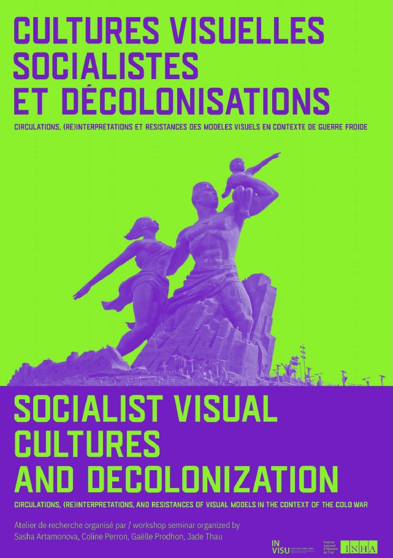

I am delighted to have been invited to present an aspect of my research on Exotic Cinema as part of an international research seminar series at the prestigious INHA (Institut national d'histoire de l'art) in Paris. The theme of this five-part seminar series entitled

**Socialist Visual Cultures and Decolonization: Circulations, (Re)interpretations, and Resistances of Visual Models in the Context of the Cold War** 

In the middle of the twentieth century, in the context of the Cold War, various countries began to envision socialism as an alternative to colonial domination. The “new Cold War history” and the scholarship on “global socialism,” which developed in the wake of Odd Arne Westad’s work, have contributed to questioning the bipolar view of the world during this period by restoring agency to countries in the process of decolonization. Far from playing a passive role in the ideological conflict between the two “superpowers,” these countries sought to make their voices heard. Numerous attempts to establish a “third way,” both ideologically and politically, emerged, and several states adopted socialist regimes that maintained sometimes complex relations with the USSR (Algeria, Vietnam, Ethiopia, among others). These nations thus became part of a “Red globalization” (Sanchez-Sibony, 2014) and engaged in a wide range of exchanges—educational, military, economic, and cultural—within a socialist camp that was far from homogeneous, reflecting the persistence of North–South dynamics throughout the Cold War.

\
Within this dual context of the Cold War and decolonization, the cultural sphere—and particularly the visual arts— occupied a crucial place. Socialism offered powerful visual models associated with ideals of international solidarity, class struggle, and resistance to colonial, racist, and imperialist oppression. For countries in the process of decolonization, the production of images served as a way to defend a worldview opposed to that of the enemy and, at the same time, to promote their emerging national cultures. Situated at the crossroads of multiple cultures and civilizations, the images produced within these postcolonial societies not only reflected this historical turning point but also actively contributed to it. Analyzing the processes of production, circulation, and reception of these images provides a key tool for understanding the formation of postcolonial nation-states. It reveals the logics of appropriation and reinvention of socialist models while highlighting the exchanges between the “brother countries” of the Global South and the Socialist Bloc. These young nations did not simply adopt external models but actively participated in their redefinition, producing hybrid images that were both local and transnational. Such visual productions testify to how postcolonial states constructed their symbolic and visual identities while asserting cultural autonomy within the networks of socialist solidarity.

You will find the full seminar programme here: 

<https://arthist.net/archive/51639>

April 8, 2026, 2 - 4 pm\
Session 3: Forms, Constructions, and Performativities of Socialists Exoticisms, moderated by Gaëlle Prodhon\
\
invited speakers: 

\
Perrine Val (Université de Montpellier Paul-Valéry): “Cinematographic Relationships Between the GDR and Its Arab and African Partners: The “Others” of the “Other” Germany?”

Daniela Berghahn (University of London): “Post-socialist nostalgia and exoticism in The Road Home and Balzac and the Little Chinese Seamstress”\
\
Registration link: <https://us02web.zoom.us/meeting/> register/zrwpL-UxT6aVf6P6VRMzmA