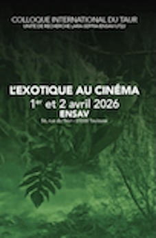

I am delighted to have been invited to present a Keynote address at a conference on *The Exotic in Cinema* (1 - 2 April 2026) in Toulouse, which has been inspired by my book *Exotic Cinema.* The Keynote is entitled 'Transnational Encounters with Cultural Difference in Exotic World Cinema'. 

Here's the Call for Papers for the conference: 

**The Exotic as a Prism of Representation**

This event aims to examine the specific and ambivalent encounter between the Other and the Elsewhere that defines exoticism in cinema. While the term “exotic” is commonly used to describe distant lands and peoples, it fundamentally refers to a type of gaze and a point of view that emanate from a place and a subject situated in a referential, if not dominant, position. We thus understand the word “exotic” in all its conceptual dynamism, which includes the different meanings that exoticism has taken on over time. 

Exoticism cannot be conceived in monolithic terms. As Daniela Berghahn masterfully analyses in *Exotic Cinema, Encounters with Cultural Difference in Contemporary Transnational Film* (2023), exoticism should be seen less as a fixed category than as a spectrum—ranging from assimilation and domestication of difference to its radical opacity. We would like the various contributions to this symposium to cover this spectrum as broadly as possible, both thematically and temporally.

**Paradoxes of Exoticism: From Praise to Stereotype**

Our approach is informed by the paradox inherent in exoticism pointed out by Tzvetan Todorov, exoticism often aspiring to be “a form of praise within ignorance.” Exoticism celebrates what is most unknown, yet in doing so it paradoxically prevents genuine knowledge. In cinema, this ambivalence emerges both as an aesthetic feeling and as a site of pleasure. ‘Exoticism is everything that is Other. To enjoy it is to learn to savour Diversity,’ wrote Segalen, who, at the beginning of the 20th century, attempted a universal theorisation of authentic exoticism, denouncing clichés and seduction. Those he called ‘the pimps of the sensation of diversity’ took over the cinema as soon as it was created. This is because exoticism is eminently visual, and the spectacle of difference has played a significant role in the history of cinema.

This “spectacle of difference” fuelled the fascination of European audiences with colonial and former colonial territories. At the same time, as Edward Said argued in *Orientalism*, it contributed to systems of domination by constructing the Other as object of representation. It should be noted that cinema has long failed to adequately capture ‘non-white’ skin, an issue analysed by Richard Dyer in *White: Essays on Race and Culture* (1997) and questioned by Diarra Souran from a technical point of view. Exoticism fascinates and, thereby, has the capacity to conceal, empty and recolour the world, as if to shrink it down to the size of a postcard. ‘Colouring the world is always a way of denying it (and perhaps we should start a trial against cinema here),’ wrote Roland Barthes in *Mythologies* (1957) about *Continent Perdu*. How, then, does this “operation of erasure” proceed in cinematic discourse and aesthetics, where exoticism purports to celebrate difference? We hope to shed light on these mechanisms, particularly in more contemporary works rather than only in the already widely-studied corpus of colonial and ethnographic cinema. 

**Decentered Exoticism**

The second part of our approach will concern what we call, with Daniela Berghahn, ‘decentred exoticism’. It explores the role of cultural translation and decentred exoticism in transnational and world cinema. How and in what forms is exoticism reinterpreted and repurposed in world cinema? The representation of ‘Self as Other’ for a dominant ‘third eye,’ as theorised by Fatimah Tobing Rony in *The Third Eye: Race,* *Cinema and Ethnographic Spectacle* (1996), essentially alienates non-Western filmmakers, who are perceived as guarantors of ‘authenticity’, thereby conforming to Western expectations. But conversely, strategies of self-exoticization or self-ethnicization offer an opportunity for radical reversals of ethnic and racial stereotypes.

In a hybrid world where cinema is becoming increasingly transnational, thus blurring boundaries between Self and Other, European and world cinema, what becomes of exoticism? What aesthetic and political strategies do filmmakers invent today to resist, subvert, or reconfigure past exoticisms?