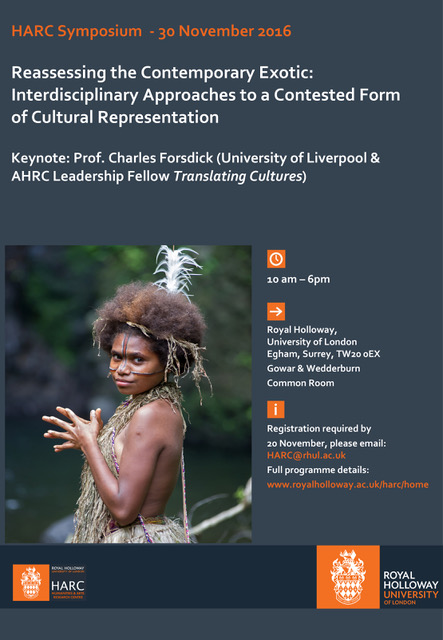

This multi-disciplinary symposium aims to shift the terms of the debate around exoticism beyond dominant scholarly discourses such as (neo-)Orientalism and (neo-)imperialism by bringing it into dialogue with alternative frameworks, notably cultural cosmopolitanism,  cultural translation, globalisation and hybridity. 

Drawing on research expertise from across the Royal Holloway and including staff, creative practitioners and PGR students, the symposium encourages new critical approaches to analysing intercultural encounters and their cultural representations. 

**Keynote Speaker:** Professor Charles Forsdick, James Barrow Professor of French, University of Liverpool, and AHRC Leadership Fellow *Translating Cultures*

## Programme

**10.00 - 11.15**

Professor Robert Hampson, Department of English, RHUL, ‘The Colonial Short Story: Adventure and the Exotic’

Domenico Galimi, PhD student, Department of Criminology, RHUL, ‘Discerning the Unfamiliar yet Familiar: Exoticism, Crime and Criminology’

 **11.15- 11.45 Tea break** 

 **11.45 – 13.00**

Mary-Jean Chan, PhD student, English Department, RHUL, ‘Towards a Poetics of Racial Trauma: Lyric Hybridity in Claudia Rankine’s *Citizen*’

Dr Julia Gallagher, Department of Politics and International Relations, RHUL, ‘African Exotic: The Uncanny in the Building of the South African State’

**13.00 – 14.00 Lunch**

 **14.00 – 15.45**

Professor Matthew Cohen, Department of Drama, Theatre and Dance, RHUL, ‘Wayang in Museums: Collecting, Conserving, Exhibiting and Performing Indonesian Puppets’

Professor Daniela Berghahn, Department of Media Arts, RHUL, ‘The Cosmopolitan Exotic on the Film Festival Circuit’

Dr Melissa Blanco Borelli, Department of Drama, Theatre and Dance, RHUL, “‘Signs Taken for Wonders’: Refashioning the ‘Exotic’”

**15.45 – 16.15 Tea break**

**16.15 – 18.00, Keynote address and response**

Professor Charles Forsdick, James Barrow Professor of French, University of Liverpool, and AHRC Leadership Fellow *Translating Cultures*, 'Exoticism as Keyword'

Professor James Williams, School of Modern Languages, Literatures and Cultures, RHUL, Response to Keynote

## Abstracts

**Professor Daniela Berghahn, Department of Media Arts, RHUL, ‘The cosmopolitan exotic on the film festival circuit’**

From the scenics of early cinema over ethnographic documentaries to contemporary world cinema, cinema has always played a pivotal role in mediating visions of cultural Otherness. By projecting images of far-away exotic landscapes, peoples and their traditions, cinema indulges armchair travellers and promotes intercultural exchange and cosmopolitan connectivity. This paper suggests that the global film festival circuit functions as a new type of ‘contact zone’, which Mary Louise Pratt  (1992) has famously theorised in the colonial context, as the ‘intercultural space of symbolic exchange and transculturation’, catering for cosmopolitan cinephiles and their interest in cultural difference. Film festivals provide a window onto different cultures, showcase films from around the world, bestow cultural prestige and prizes onto films which would otherwise never be ‘discovered’ and, according to Bill Nichols (1994), invite festival audiences to become anthropological field workers who become ‘submerged in an experience of difference, entering strange worlds, hearing unfamiliar languages, witnessing unusual styles.’ 

 

**Dr Melissa Blanco Borelli, Department of Drama, Theatre and Dance, RHUL, “‘Signs Taken for Wonders’: Refashioning the ‘Exotic’”**

This paper examines the iconography of the black female body by surveying how black women performers engage with modernist ideas of blackness and invent ways to refashion, deconstruct, and contemporise it. Starting with the powerful images and performances of Josephine Baker and moving to contemporary performers and style icons such as Beyoncé, Solange, Ibeyi and the Quann sisters, I will lay out an iconographic topography of how black women negotiate ways to speak back to hegemonic constructions of beauty, femininity and blackness. My title comes from Homi Bhaba's classic text, which interrogates the fixity of signs (i.e., the English book) in the imperial enterprise. Just as he argues how the colonized used these tools of imperial repression to resist colonialism, I argue for how these women engage in subversive 'exotic' refashionings of the modernist fantasies about black femininities.

**Mary-Jean Chan, PhD student, English Department, RHUL, ‘Towards a Poetics of Racial Trauma: Lyric Hybridity in Claudia Rankine’s *Citizen*’**

The longevity of the lyric belies persisting difficulties in terms of its definition and categorization, particularly given the form’s evolution in the face of philosophical, socio-political and cultural transformations. In Claudia Rankine’s *Citizen*, the lyric is powerfully refashioned in response to the historical and contemporary tribulations of being a black citizen in America. Rankine’s keen awareness of how linguistic injury caused by micro-aggressions registers in the body leads her to an adoption and *adaptation* of the lyric form, with *Citizen* aptly sub-titled: *An American Lyric*. *Citizen* is an urgent and timely book that sustains America’s conversation on race and racial injustice on a level of national grief, even as Rankine brings it to the level of personal intimacy by asking: ‘How do you make a body accountable for its language, its positioning?’ I contend that *Citizen* is a work that extends the lyric’s possibilities through creating a hybrid text containing lyric essays, photography, public art and video scripts, which are juxtaposed for inter-textual and polyphonic effects. I argue that Rankine uses lyric hybridity to create a poetics of racial trauma that meditates on the effects of racial injustice as it manifests in the bodies of traumatized individuals. Lyric hybridity appears crucial to Rankine’s project, since it allows for complex subjectivity and intimate address amidst a clarity of language that enables the reader to perceive how we easily we fail one another in our daily pursuit of relationality, community and citizenship.

**Professor Matthew Cohen, Department of Drama, Theatre and Dance, RHUL, ‘Wayang in Museums: Collecting, Conserving, Exhibiting and Performing Indonesian Puppets’**

Over the last years, I have had opportunities to visit, handle, study up close and work with a number of significant public and private collections of Southeast Asian (particularly Indonesian wayang puppets) in Europe and North America as a visiting performer, consultant, curator and researcher.

In this presentation, I would like to offer some preliminary thoughts on my visits to these museumified puppets, discussing provenance; issues in collecting, storage and conservation; exhibition strategies; and cultural programming in conjunction with exhibitions. My intention is to get beyond narratives of expropriation to think about the potential of these entangled objects to fuel creative expression, collaborative scholarship and art making, arts diplomacy and multi-national cooperation.

With Edward Said in mind, I will read these puppets ‘contrapuntally, that is, as figures” which travel “across temporal, cultural and ideological boundaries in unforeseen ways to emerge as part of a new ensemble along with later history and subsequent art.’ I take particular inspiration here from James Clifford who speaks of how ‘museums \[might] become way stations rather than final destinations’ and Nicholas Thomas, who discusses a process of ‘reverse repatriation’ by which artists and other agents can bring home to objects in museums far from their sites of origin.

**Professor Charles Forsdick, James Barrow Professor of French and AHRC Theme Leadership Fellow for Translating Cultures, University of Liverpool, 'Exoticism as keyword'**

Although absent from *Keywords: A Vocabulary of Culture and Society* (1976) and also from the revised version of the text, *New Keywords: A Revised Vocabulary of Culture and Society* (2005), exoticism seems to lend itself to the approach proposed by Raymond Williams: i.e., the term may be seen to exemplify the understanding of the ‘keyword’ as part of ‘a vocabulary to use, to find our ways in, to change as we find it necessary to change it, as we go on making our own language and history’. Central to such an approach is an awareness of the (un)translatability of exoticism, the meanings of which in an Anglophone context are very different from those in the French-speaking world. Engaging initially with the emergence and evolution of the concept of *exotisme* in the work of Victor Segalen, the paper will consider the term as a ‘keyword’ that has evolved across the twentieth century and, despite the ideological and theoretical challenges to which it has been subject, persisted into the twenty-first. I will explore the understandings of Segalenian exoticism that have emerged from the selected fragments of the *Essai sur l'exotisme* currently available in a published form, and track the ways in which these have formed the basis of dialogues with a range of key thinkers and writers including Jean Baudrillard, Patrick Chamoiseau, James Clifford and, perhaps most significantly, Edouard Glissant. The paper concludes with a reflection on the status of exoticism as a concept in a postcolonial frame, and explores its persistence in a number of recent studies across a range of disciplinary fields.

 

**Dr Julia Gallagher, Department of Politics and International Relations, RHUL, ‘African Exotic: the uncanny in the building of the South African State’**

The paper explores African exotic as ‘uncanny’; and further argues that it contributes to state authority in South Africa. The argument is illustrated by a discussion of the architecture of two state buildings.

The exotic is uncanny because it contains elements of sexual or aggressive facets of oneself that have been repressed through socialisation. It is frightening and fascinating because these elements are recognised but also forbidden.

Colonial architecture represents civilisation’s triumph over the exotic. However, it is uncanny because the exotic is repressed by, but also a continuing subtext for, civilisation, a reminder of the only ever partial triumph of civilisation over the primordial. South Africa’s Union Building as an embodiment of the colonial/apartheid state is effective because uncanny.

Much post-apartheid public architecture is designed to characterise Africanness. But it too draws on the idea of African exotic. The DIRCO building blends African kitsch, or hints at hidden Africanness, contained within a reassuringly bland international modernism. Africanness remains repressed, continuing its role as the uncanny exotic.

**Domenico Galimi, PhD student, Department of Criminology, RHUL, ‘Discerning the unfamiliar yet familiar: Exoticism and Criminology’**

While the root of exoticism is in arts and design, nowadays it may be possible to say that the allure of the other pervades all aspects of life, beyond art, design and the artistic scene.

Exoticism has often been defined as the "charm of the unfamiliar". It may incarnate in several forms, such as primitivism, or humanism. This paper wants to focus on a particular aspect of "modern humanism", criminality and the seduction of evil, a topic which bombards our everyday life and, yet, it is understood very little.

This paper is an interdisciplinary approach to White Collar Crime, perhaps the most misunderstood type of crime and the most "alien" to the ordinary mindset; specifically, the analysis of Insider Dealing through the interdisciplinary approach of Law, Psychology and Biosocial Criminology. 

A legal analysis is presented first and foremost, detailing the essential traits of inside information, the insider and criminal behaviour at domestic and EU level. Afterwards, a series of criminological, biological and biosocial observations will be made, drawing heavily upon Sutherland's work and recent depictions of white-collar Crime, also emphasising how certain types of criminal behaviour reach deep into human minds and emotions, being familiar and yet alien.

 

**Professor Robert Hampson, Department of English, RHUL, ‘The colonial short story: adventure and the exotic’**

The paper will examine the history of the colonial short story, more specifically the ‘exotic story’, from Rudyard Kipling to Somerset Maugham and Graham Greene. It will use this history as a way of exploring the term ‘exotic’ and posing the question ‘exotic to whom?’. Beginning with the publication history of Kipling’s Indian short stories, as the site of publication shifts from Lahore to Allahabad to London, the paper shows how the changes in readership for the fictions produced different conceptualisations of ‘the exotic’. It will consider colonial short fiction by Conrad, Maugham and Greene in this context, attending to Maugham’s sense of belatedness and the routinizing and commodification of ‘the exotic’ in Greene’s short fiction.  The paper will conclude with considering the implications of ‘the exotic’ for present