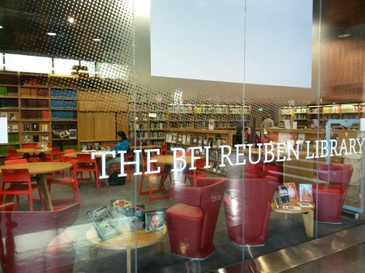

On 13 May 2024 @ 6.30pm I will be giving a [BFI Reuben Library Talk](https://whatson.bfi.org.uk/Online/default.asp?doWork::WScontent::loadArticle=Load&BOparam::WScontent::loadArticle::article_id=785DF5CA-992D-4661-B769-E8E1F248ADE1&BOparam::WScontent::loadArticle::context_id=6BB72C11-3E9E-4B61-97BD-BC678DBB651C). Tickets will go on sale on 21 March and can be purchased on the [BFI website](https://whatson.bfi.org.uk/Online/default.asp?doWork::WScontent::loadArticle=Load&BOparam::WScontent::loadArticle::article_id=785DF5CA-992D-4661-B769-E8E1F248ADE1&BOparam::WScontent::loadArticle::context_id=6BB72C11-3E9E-4B61-97BD-BC678DBB651C).

Here's the annoucement: 

We are delighted to welcome Daniela Berghahn to discuss her latest book Exotic Cinema: Encounters with Cultural Difference in Contemporary Transnational Film (Edinburgh University Press, 2024). Through close visual readings of the Indigenous film *Embrace of the Serpent* and the Hong Kong horror movie *Dumplings*, Daniela will undertake a critical reassessment of the problematic concept of exoticism; demonstrating that these films use the exotic gaze to draw attention to climate change and to critique the material excess of contemporary consumer culture.

