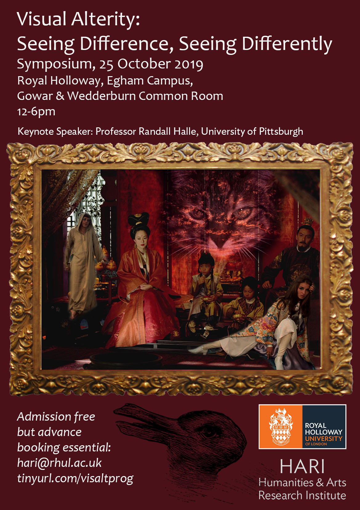

An interdisciplinary symposium hosted by the Humanities and Arts Research Institute at Royal Holloway

Keynote Speaker: Professor Randall Halle, the Klaus W. Jonas Professor of German Film and Cultural Studies, University of Pittsburgh

The Symposium explores the concept of visual alterity from two different angles, considering, on the one hand, the perception of cultural difference in dance, fashion photography and contemporary cinema, and, on the other hand, ways of seeing differently, drawing on experimental cinema, video games, music video and virtual and augmented reality.