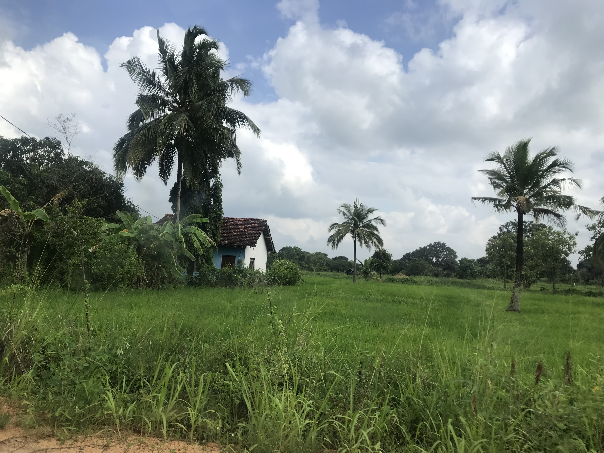
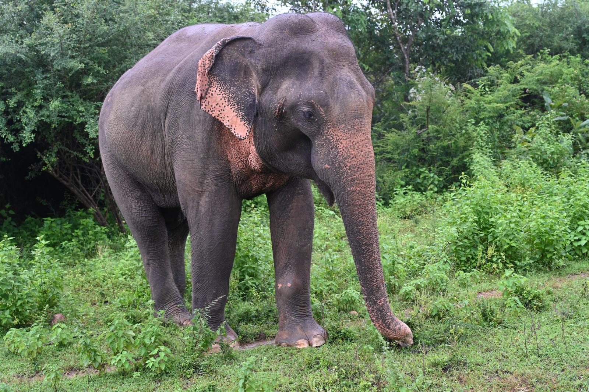
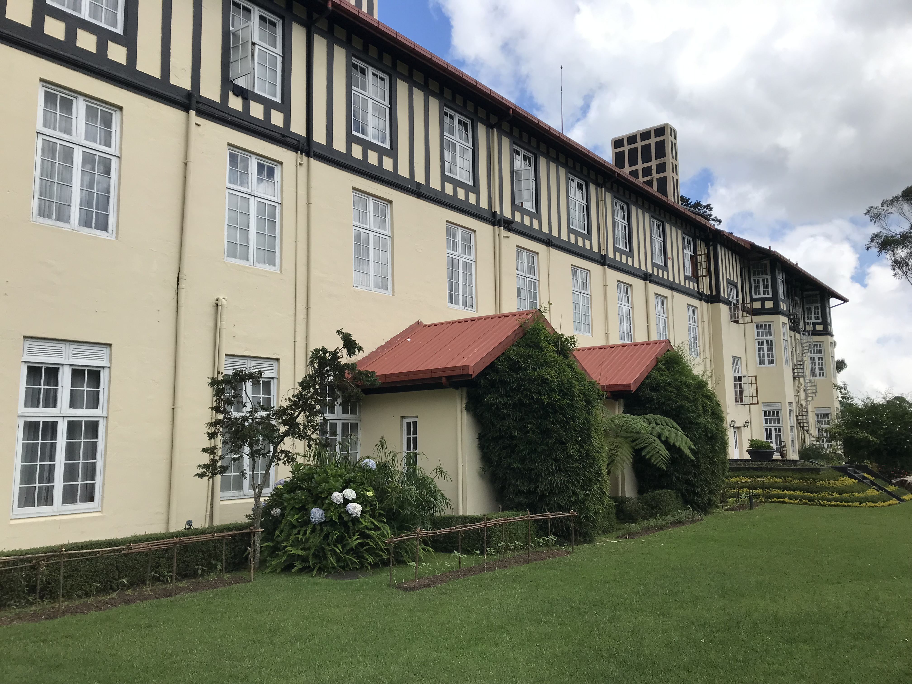

It would probably be an exaggeration to claim that during our recent holiday in Sri Lanka I undertook serious fieldwork on exoticism. Nevertheless, the encounter with such in indisputably exotic culture gave rise to many reflections on the topic that has preoccupied me for several years now.  This was not only triggered by the exotic flora (coconut palm trees, rice paddies, banana, spice plantations and flowers as 

temple offerings) and fauna (elephants, monkeys and even the elusive leopard), the overall sense of lushness and abundance, the tangible legacies of Sri Lanka’s colonial past (Dutch, Portuguese and British) but also by the fact that our Sri Lankan driver and guide kept using the word ‘exotic’ quite lot. Predictably,  what appeared exotic to him in his home country, was not what I would have described as exotic. While this confirmed my argument that the perception of the exotic is relative, depending on the positionality and specific cultural background of the perceiving subject, our guide Harindu’s description of the Horton Plains (see the first photo) in Sri Lanka’s central highlands as an ‘exotic landscape’ led me to reflect upon my argument about the reversal of the exotic gaze, as outlined in my book. 

In the chapter ‘The Exotic and the Tourist Gaze’, I propose in relation to Bollywood cinema’s depictions of Europe that ‘it remains questionable whether the scenic snapshots of European tourist attractions—except for the fantasy of Europe as a pastoral idyll—stand in this discursive tradition and actually reverse the exotic gaze. It seems to me (even though my interpretation may be compromised by one of the blind spots that come with my European heritage) that a reversal of the exotic gaze in Bollywood cinema which constructs Europe as exotic is irreconcilable with exoticism’s discursive history and its inherent logic of centre and periphery.  While this logic accommodates the performance of self-exoticism in world cinema, a decentring of the exotic gaze from the periphery onto the European centre transcends the limits of exoticism’. This is to a large extent due to the fact that the exotic gaze invokes a *déjà vu,* insofar as it cites, recycles or repurposes familiar narrative tropes and a familiar iconography that dates back to the old, colonial, Eurocentric exoticism. 

 However, as we were set off one early morning from Nuwara Eliya, a former British hill station and resort, also known as ‘Little England’, to hike across the nearby Horton Plains, a landscape that bears great resemblance with the Scottish Highlands and that, in Harindu’s view is a quintessentially ‘exotic landscape,  I began to wonder about the reversibility of the exotic gaze. While his use of the term ‘exotic’ corresponds with the definition I use in my book, it challenges the idea that exoticism is inherently Eurocentric. Perhaps it is more appropriate to think of it as having arisen from the colonial encounter and working in both directions.

When the British came to Sri Lanka to start a new life as tea plantation owners, they fell in love with the Horton Plains, a landscape that reminded them of home. Like in the Scottish Highlands, they went hunting on the Horton Plains. Of course, the Sri Lankans knew of the existence of this wild and untamed stretch of countryside beforehand but only through the Scottish tea plantation owners, did they ‘discover’ its beauty and its Otherness.