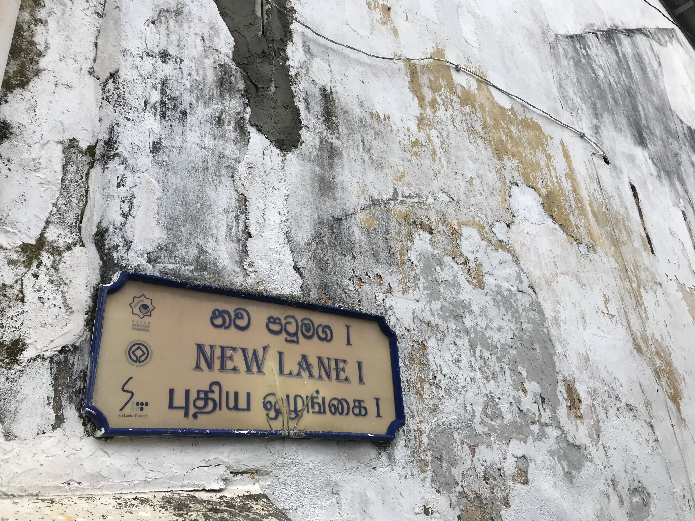
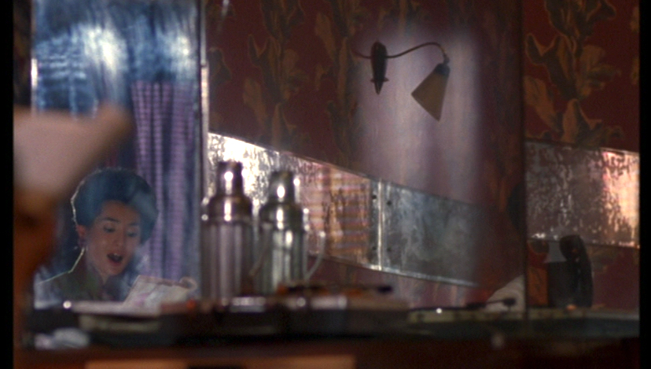
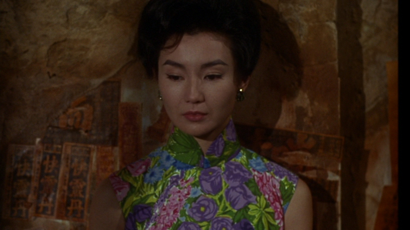

When we ambled along the streets of the beautiful town of Galle in southwest Sri Lanka earlier this year, I was often more intrigued by the texture of distressed surfaces, of walls whose crumbling plaster was covered in moss and mould, than by the architectural sights. Capturing these natural, yet artful, compositions of green and pink and grey with the lens of my iPhone was not enough to take in their beauty. I felt a great desire to touch them with my fingertips, feel the moisture of the weather-beaten plaster, the soft, squidgy texture of the green mosses and explore whether the thick grey mould would rub off on my hands. It instantly made me think of Laura Marks’ influential theorisation of ‘haptic visuality’, which refers to a particular type of embodied perception that invokes memories of touch but represents them visually on screen. 

Exploring the weathered surfaces of Galle with my eyes and hands and the lens of my camera, I even wondered whether there is a natural affinity between haptic visuality, the tropics and exoticism. Does not the heat and extreme humidity of tropical climates produce the perfect natural conditions for plaster, wood and even stone to decompose and deteriorate in highly decorative fashion? 

 Strolling along the narrow alleyways of Galle, reminded me of the textured surfaces in Wong Kar-wai’s *In the Mood for Love*, much of which was actually shot in Bangkok because contemporary urban Hong Kong lacks the nostalgic flair of the 1960s, when the film is set. Visual spectacle alone does not adequately account for the exoticism of Wong’s film (exquisitely captured by Christopher Doyle’s distinctive cinematography), which goes far beyond an aesthetic of visual plenitude, provoking instead a multisensory response in the spectator. 

The camera seems to caress the texture of surfaces, whether it is masonry, pock-marked with greenish-white lichen in Angkor Wat, the crumbling plaster and peeling posters in the alleyways, the smooth reflection of speckled old mirrors, or the glistening wet rain on a streetlamp and on Chow’s jet-black hair. The close-ups of these coarse, smooth and wet surfaces emphasise tactile impressions and reproduce the multisensorial pleasure that is inextricably linked to exoticism.

