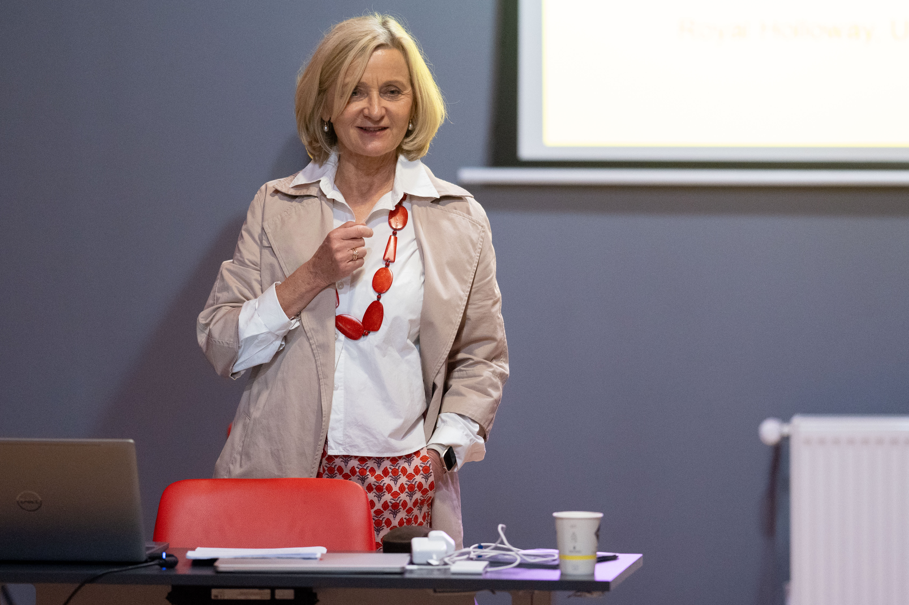

I feel immensely honoured to have been awarded not just one but two prizes for my book *Exotic Cinema*: [The Janovics Award for Outstanding Research in the Humanities](https://teatrufilm.ubbcluj.ro/cercetare/centre-de-cercetare/janovics-center-for-screen-and-performing-arts-studies/) in the field of transnational film and theatre and [The African Studies Centre ](https://cestaf.centre.ubbcluj.ro)Author of the Year Award, both from Babes-Bolyai University in Cluj-Napoca. I have just returned from a wonderful Awards Colloquium, hosted by Constantin Pârvulescu and Miruna Runcan at the Janovics Center, which is part of the Faculty of Theatre and Film. 

I thoroughly enjoyed the presentations of my fellow laureates Athina Stourna (Best Essay prize for her exploration of the domestic kitchen as performance space) and Victoria Shmidt (Special Mention for her book on health films in Central Eastern Europe). 

Thank you, Constantin Pârvulescu, for organising such a truly inspiring event and for your warm hospitality.