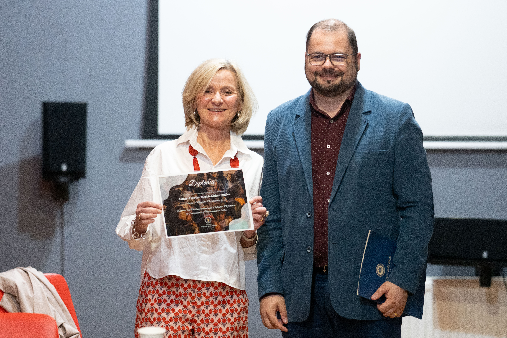

I feel immensely honoured to have been awarded not just one but two prizes for my book *Exotic Cinema*: The [Janovics Center Award for Outstanding Humanities Research in Transnational Film and Theatre](https://teatrufilm.ubbcluj.ro/cercetare/centre-de-cercetare/janovics-center-for-screen-and-performing-arts-studies/)  and the Author of the Year 2024 in African Studies Award by [The African Studies Centre](https://cestaf.centre.ubbcluj.ro), both at Babes-Bolyai University in Cluj-Napoca. I have just returned from a wonderful Awards Colloquium, hosted by Constantin Pârvulescu and Miruna Runcan at the Janovics Center, which is part of the Faculty of Theatre and Film. 

I thoroughly enjoyed the the lively discussions with the audience, following my presentation, and the papers of my fellow laureates Athina Stourna (Best Essay prize for her exploration of the domestic kitchen as performance space) and Victoria Shmidt (Special Mention for her book on health films in Central Eastern Europe). 

Thank you, Constantin Pârvulescu, for organising such a truly inspiring event and for your warm hospitality.