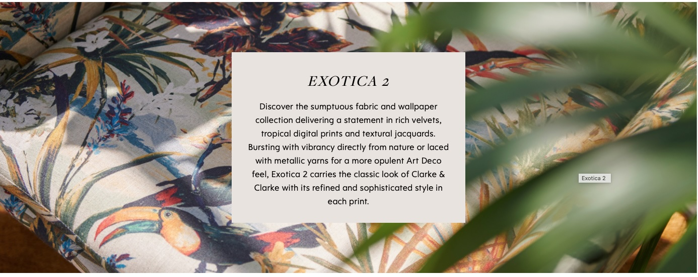

This morning, an email from the interior design company Clarke & Clarke landed in my inbox, advertising two new lines of wallpapers and fabrics, called 'Exotica 2' and 'Wilderie'. Wilderie's highly ornate prints are exotic through and through - vibrant colours, exotic animals like tigers, giraffes and even red elephants with black spots. 

These prints are part of a new (or not so new) interior design trend called 'Maximalism', a counter trend to 'Minimalism'. AI tells me that 'maximalism in interior design is *a bold, exuberant style characterized by "more is more"*. It emphasizes layering patterns, textures, and colors to create a visually rich and personalized space. Think of it as the antithesis of minimalism, embracing abundance and storytelling through decor.' 

Of course, this trend is not new at all, as Emmanuelle Gaillard and Marc Walter illustrate in their book *A Taste for the Exotic: Orientalist Interiors* (2011). 'In the 18th and 19th centuries, architects and decorative artists were constantly seeking new sources of inspiration to satisfy the demands of their rich patrons. While some revisited the canons of the classical world, others began to turn their eyes towards the East, and the "Oriental" became a byword for spectacle and sensuality. The result was a wave of creative expression that encompassed everything from the smallest objets d’art to entire buildings. This sumptuously produced book explores the enduring allure of Orientalist decor and introduces the princes and aristocrats, artists and poets who commissioned these opulent interiors. Packed with images of beautiful decorative objects, extravagant interiors, sumptuous fabrics and ornate furniture, this book will transport the reader to another time and place.' 

Although I object to the common conflation of exoticism and Orientalism, regarding the latter as a sub-category of the more encompassing term exoticism, the desire for abundance, lushness and excess is common to both aesthetic sensibilities. Whereas Edward Said uses 'exotic' as an attribute of the Orient or the Oriental in his seminal book *Orientalism* (1978), in my book *Exotic Cinema* (pp. 23-29), I delineate how the two concepts overlap and differ. Exoticism encompasses specific discourses on Othering, notably Orientalism and primitivism, as well as aestheticised cultural translations, such as *chinoiserie* and *japonisme*. Orientalism is more limited in its geographical scope to the Arab Islamic world of the Middle East; by contrast, the imaginative geography of exoticism covers a wider and more heterogeneous terrain, including Oceania, Amazonia and other parts of the New World. Importantly, exoticism's fascination with the foreign is very much about the natural world, its exotic flora and fauna.  And finally, as I argue in my book *Exotic Cinema*, Orientalism is about the power to dominate while exoticism is about the pleasure of difference.

It is thus not surprising that certain manifestations of Maximalism in interior design are aligned with exoticism's fascination with the foreign, the hedonism and sensuousness associated with opulence and the spectacle of cultural difference.